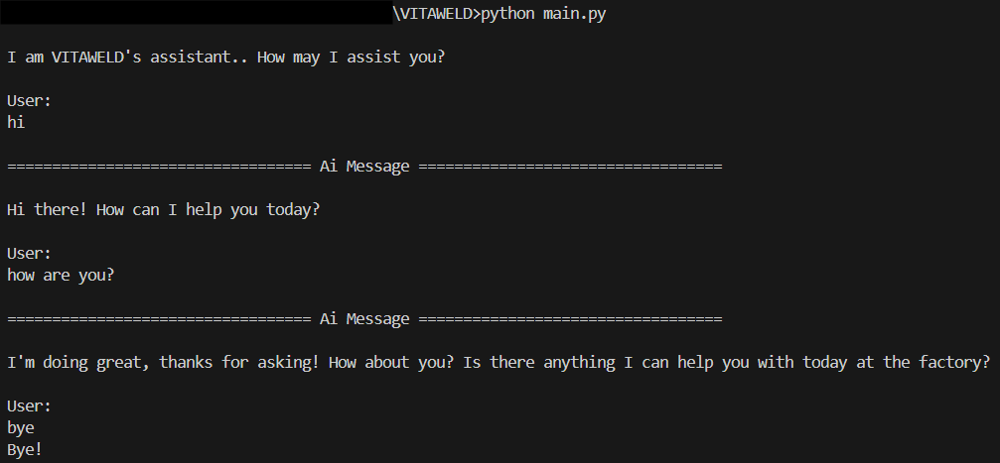

<div align="center">

  

</div>

# Reusable Conversational AI Agent Module

## Overview

The **VITAWELD Conversational AI Agent** is a reusable and framework-agnostic software module developed under the ARISE initiative.
It provides a language-model–based orchestration agent capable of managing natural-language conversations and coordinating external tools through structured reasoning.

Its derived from the VITAWELD MVP and designed to serve as a standalone orchestration component for other ARISE applications requiring intelligent, language-driven interaction.

This module has been **developed by Rovimatica** as part of the **VITAWELD project**, within the **ARISE initiative**, contributing to the development of reusable and intelligent software components for industrial AI systems.

## Architecture


The agent follows the **ReAct (Reason + Act)** architecture — a modern approach for building intelligent systems that combine reasoning and action. Its goal is to combine logical reasoning **("Reasoning")** with the ability to act **("Acting")** within a structured cycle, allowing the agent not only to generate text, but also to think, decide, and execute actions based on the input prompt. The agent will call on the tools needed to resolve the user's request or respond directly to the user if no tools are needed to resolve the task.
This design enables the agent not only to generate coherent text responses, but also to **plan, decide, and invoke tools** dynamically to fulfill user requests.

Allows the use of tools developed by any user, which can be executed either in series or in parallel, depending on their needs.
To do it in parallel, the Ray framework has been implemented, which allows functions to be launched in independent processes under a wrapper established using @ray.remote.

**Key features**

- **LangGraph-based orchestration** for structured conversational flow and tool invocation.
- **Tool extensibility**: developers can register any number of tools, which may run sequentially or in parallel.
- **Ray integration for parallel** (asynchronous) tool execution, preventing blocking during long-running tasks.
- **Configurable LLM parameters** (model, temperature, etc.) through a dedicated configuration file.
- **Framework-agnostic** and **easily integrable** with other ARISE modules, including robotic, simulation, or process-control systems.

## Repository Structure
#### *assistant.py* 
Basic module of the AI VITAWELD assistant, with the structure of the conversational graph and the flow of conversation.

**Main Classes**:
- **VitaweldAssistant**: Main agent class managing configuration, tools, and conversation flow.
- **RayToolNode**: Handles tool execution (parallelized via Ray when enabled)..

#### *config.py* 
Configuration module of the AI VITAWELD assistant.

**Main class**:
- **Config**: Manages global parameters:
    - **MODEL**: Model name or version.
    - **TEMPERATURE**: Creativity level of responses.
    - **MAX_TOKENS**: Maximum output length.
    - **TIMEOUT**: Response timeout.
    - **MAX_RETRIES**: Automatic retry attempts.
    - **API_KEY**: Model API authentication key.
    - **SYSTEM_PROMPT**: Behavioral and instruction setup.
    - **CONFIG**: Thread or conversation context ID.
    - **MEMORY**: Enables contextual memory between dialogue turns.

#### *init.py* 
Environment initialization module.

**Function**:
- **setup_environment()** – Prepares dependencies and environment variables required by the assistant.

#### *main.py* 
Main execution entry point of the VITAWELD assistant.

**Function**:
- **main()** – Launches the assistant and starts the conversation loop.

## Installation

1. Ensure Python 3.11 is installed (e.g., via Anaconda for a clean, isolated environment).
2. In the project root, install dependencies with:
```bash
pip install -r requirements.txt
```

## Usage

1. Configure your assistant in the config.py file (model, API key, temperature, etc.).
2. Run the assistant with:
```bash
python main.py
```
3. Once running, start interacting with the assistant directly in the console.
4. To end the execution, type **"exit"**, **"quit"** or **"bye"**.



## Contribution to ARISE

The VITAWELD Conversational AI Agent has been developed and maintained by **Rovimatica**, representing its contribution to the **ARISE ecosystem of reusable modules**. It provides a **configurable and LLM-driven orchestration layer** that other partners can integrate into their own AI-assisted applications.

## 🧾 License

This software module is released under the **Apache License 2.0**.  
© 2025 Rovimatica — developed within the VITAWELD project (ARISE initiative).

---

<div align="center">

  
  
  

</div>
