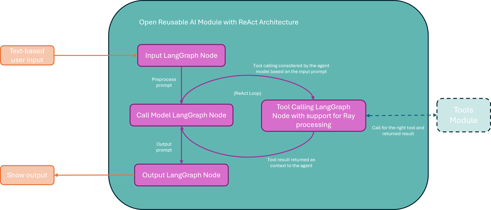
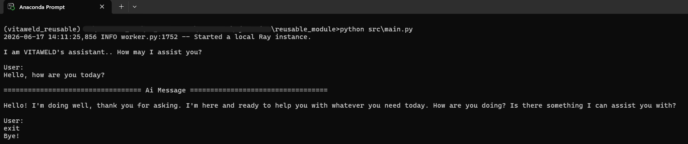
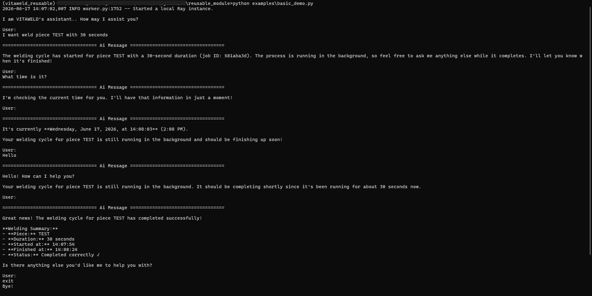
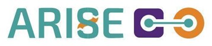
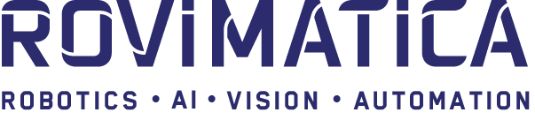

# VITAWELD Conversational AI Agent

A reusable, framework-agnostic LLM orchestration agent developed within the **VITAWELD** project, part of the **ARISE** initiative.

<div align="center">

  

</div>

---

## 1. Module introduction

The **VITAWELD Conversational AI Agent** is a reusable software module that provides a language-model–based orchestration layer. It interprets natural-language input, keeps conversational context, decides whether to answer directly or to invoke external tools, and coordinates those tools through structured reasoning (a **ReAct** — *Reason + Act* — loop built on **LangGraph**).

- **Problem addressed.** In industrial settings, operators often have to interact with several specialised software tools, each with its own logic and learning curve. This module offers a single natural-language entry point that can orchestrate those underlying capabilities, lowering the barrier for non-expert users.
- **Inputs.** Natural-language user messages, plus a set of user-defined tools (Python callables) registered by the integrator.
- **Outputs.** Natural-language responses and structured tool invocations, with tool results fed back into the conversation.
- **HRI / robotic capability delivered.** A conversational *mission-controller* / orchestration layer that turns operator requests into coordinated tool actions, without forcing a rigid step-by-step sequence.

The module is **standalone and framework-agnostic**: it focuses purely on conversation handling, tool invocation and response management, and is neutral with respect to the systems it controls.

## 2. Connection with ARISE

This module is the open, reusable extract of the **mission controller** used in the VITAWELD TRL6 demonstrator, where it orchestrated the complete robotic-welding workflow (part selection, weld definition, workpiece positioning, parameter configuration, trajectory generation, execution and monitoring) through natural-language interaction.

It contributes to the ARISE ecosystem as a **reusable orchestration component** that any partner can integrate into AI-assisted, human-centric applications requiring natural-language–driven interaction.

**ARISE middleware interfaces (scope of this open module).** The agent is deliberately decoupled from any specific middleware. In the VITAWELD demonstrator, the connection to the ARISE middleware was implemented **outside** the agent, inside the tools registered into it:

| ARISE interface | Status in this module | Rationale |
|---|---|---|
| ROS 2 / Vulcanexus | N/A (not bundled) | The agent is not a ROS 2 package. In the demonstrator, ROS 2/Vulcanexus communication lived in the external tools the agent invoked. The module exposes a clean Python tool interface so that a ROS 2 bridge tool can be plugged in. |
| FIWARE / NGSI-LD | N/A (not bundled) | Context-broker integration was handled by a dedicated demonstrator component, not by the agent. |
| DDS enabler | N/A (not bundled) | No DDS communication is performed by the agent itself. |
| ROS4HRI | N/A (not bundled) | The agent does not produce or consume ROS4HRI messages directly. In the demonstrator, ROS4HRI-compatible human-state and gesture information was produced by perception tools and surfaced to the agent only as tool inputs/events. |

See [`docs/02_interfaces.md`](docs/02_interfaces.md) for the full interface discussion and the demonstrator mapping.

## 3. Target platforms

The module is **pure software with no hardware dependency**. Its only external runtime dependency is access to an LLM API (currently Anthropic / Claude). Any robot, sensor or simulator is reached **indirectly**, through a tool that the integrator registers.

| Target platform category | Tested on | Expected compatibility | Not supported / unknown |
|---|---|---|---|
| Manipulator / cobot | KUKA welding cell (in the demonstrator, via external tools) | Any manipulator reachable through a user-provided tool | Direct / native robot control (out of scope) |
| Mobile robot / AMR / AGV | No | Reachable through a user-provided tool | Direct control |
| Humanoid / social robot | No | Reachable through a user-provided tool | Direct control |
| Industrial cell / PLC-integrated setup | KUKA robotic welding cell (demonstrator) | Yes, via integration tools | Native PLC protocols (out of scope) |
| Sensors (RGB-D, camera, safety scanner, etc.) | No (perception handled by external tools in the demonstrator) | As tool inputs/events | Direct sensor drivers |
| Simulation (Gazebo / Isaac Sim / Webots / RViz / mock) | No (not bundled) | Drivable through a user-provided tool | Bundled simulator |

## 4. Robot missions and tasks

| Mission type | Contributes? | How |
|---|---|---|
| Operator monitoring or assistance | Yes | Provides the conversational layer that guides and assists the operator through a workflow. |
| Safety-aware task execution | Indirectly | Can route safety-related events (e.g. a stop command) to the appropriate tool/action; the safety logic itself is external. |
| Quality inspection | Indirectly | Can trigger an inspection tool and report its result conversationally. |
| Collaborative assembly / handover / navigation / intralogistics / teleoperation | N/A out of the box | Achievable only if the integrator registers the corresponding tools. |

The concrete robotic **tasks** are delivered by the tools the integrator registers; the module itself contributes the **orchestration** of those tasks from natural language.

## 5. Off-the-shelf capabilities

| Capability | Input | Output | Interface | Status |
|---|---|---|---|---|
| Conversational orchestration (ReAct) | Natural-language text | NL response + tool-call decisions | Python API / console | Implemented (used in demonstrator) |
| User-defined tool registration & invocation | Python callables (`@ray.remote` tools) | Tool results fed back into the dialogue | Python API | Implemented (parallel, non-blocking background execution via Ray) |
| Conversation context memory | Dialogue turns | Maintained per-thread context | In-memory (`MemorySaver`) | Implemented (non-persistent) |
| Configurable LLM backend | Config parameters | Configured chat model | `config.py` | Implemented (Anthropic / Claude) |

## 6. Quick start (Hello World)

The hello world runs the agent in the console and **requires no industrial hardware** — only Python and an LLM API key.

**Prerequisites:** Python 3.11 and an Anthropic API key.

```bash
# 1. Install dependencies
pip install -r requirements.txt

# 2. Configure the agent
#    Copy the configuration template and fill in MODEL and API_KEY
cp config/config.example.py src/vitaweld_agent/config.py

# 3. Run the agent
python src/main.py
```

Expected result: the agent starts and prints

```
I am VITAWELD's assistant.. How may I assist you?
```

Type a message to chat with it; type `exit`, `quit` or `bye` to stop. If you get a coherent reply, the installation is correct.

<div align="center">

  

</div>

## 7. Basic demo

The basic demo shows the agent **reasoning and invoking a tool**, not just chatting. It registers a simple, domain-neutral example tool (`examples/example_tool.py`) so it can be run without any robot or welding setup.

```bash
python examples/basic_demo.py
```

<div align="center">

  

</div>

In the demo, ask something that requires the example tool (e.g. *"What time is it?"*). The agent will decide to call the tool, execute it, and report the result in natural language. Expected behaviour and a screenshot are documented in [`docs/04_basic_demo_how_to_use.md`](docs/04_basic_demo_how_to_use.md).

In the image, you can see how a task (welding mock) runs in the background while the system is asked to tell the time (another tool), and then we greet the assistant. You can see how, after the background tool finishes—and after having already responded to several separate intermediate messages—the assistant provides the welding report.

Demonstrator video (full TRL6-7 use case): see [`media/video_link.md`](media/video_link.md).

## 8. Limitations

- **Framework-agnostic by design:** no ROS 2/Vulcanexus, FIWARE/NGSI-LD, DDS or ROS4HRI integration is bundled (see Section 2).
- **LLM provider:** currently bound to the Anthropic (Claude) provider via `ChatAnthropic`; another provider requires adapting `init.py`.
- **Asynchronous results:** tools are dispatched as parallel, non-blocking Ray tasks; their results are delivered asynchronously as a follow-up message once finished, rather than inline in the same turn. The module starts a local Ray runtime on first use.
- **Memory:** conversation memory is in-memory and not persisted across runs.
- **Runtime cost:** running the agent requires a valid LLM API key and incurs the corresponding usage cost.
- **Interface:** the open module provides a console interface only; the graphical web application is part of the (proprietary) demonstrator.
- **Proprietary boundary:** the welding-specific tools and integrations (trajectory generation, candidate selection, workpiece positioning, weld-quality vision, gesture/ROS4HRI bridge, FIWARE bridge, web application) are **not** part of this open release.

## 9. Repository structure

```
├── README.md
├── LICENSE
├── NOTICE
├── requirements.txt
├── docs/                   # 01_arise_context … 05_role_in_demonstrator
├── src/vitaweld_agent/     # agent source code
├── src/main.py             # hello world code
├── examples/               # basic_demo.py, example_tool.py
├── config/                 # config.example.py
└── media/                  # architecture diagram, screenshots, video_link.md
```

## 10. Maintainer, contact and citation

- **Maintainer:** Rovimatica — *Eduardo Moscosio, eduardo.moscosio@rovimatica.eu, edmosRovi*
- **Issue tracker:** GitHub Issues of this repository
- **Suggested acknowledgement:** *"VITAWELD Conversational AI Agent, developed by Rovimatica within the VITAWELD project (ARISE initiative)."*

## 11. License

Released under the **Apache License 2.0**. See [`LICENSE`](LICENSE).
© 2025 Rovimatica — developed within the VITAWELD project (ARISE initiative).

---

<div align="center">

  
  
  

</div>
